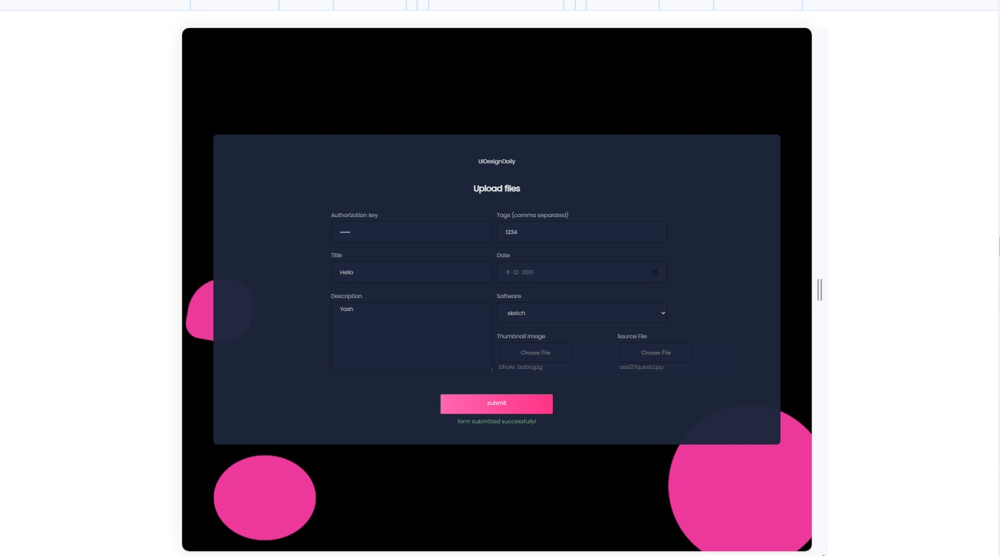
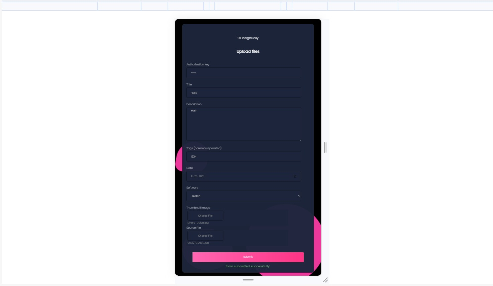
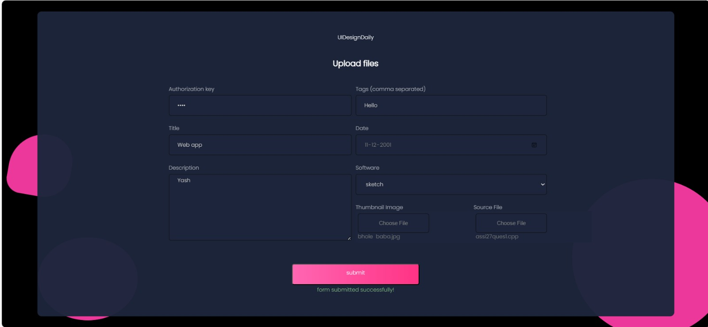
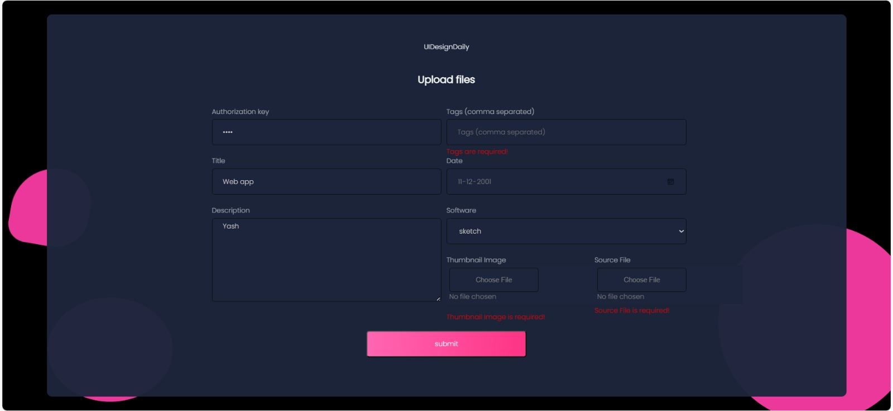

# Form Submission and Validation Interface Documentation

## Table of Contents
1. [Introduction](#introduction)
2. [Installation](#installation)
3. [Project Structure](#project-structure)
4. [Components](#components)
   - [Form](#Form)
5. [Responsiveness](#responsiveness)
6. [Usage](#usage)

## 1. Introduction <a name="introduction"></a>

This React-based project employs a component named Form to create an intuitive and user-friendly form for capturing UI design data. Leveraging React hooks, the form incorporates robust client-side validation to ensure that all required fields are filled, accompanied by dynamic error messaging. Additionally, it utilizes Axios for seamless handling of form submissions, providing a smooth user experience during the data upload process and display success message from server side when form is submitted successfully.

## 2. Installation <a name="installation"></a>

To run the project locally, follow these steps:

1. Clone the repository:

    ```bash
    git clone <repository-url>
    ```

2. Navigate to the project directory:

    ```bash
    cd <project-directory>
    ```

3. Install dependencies:

    ```bash
    npm install
    ```

4. Start the development server:

    ```bash
    npm start
    ```

The application will be accessible at `http://localhost:3000` by default.

## 3. Project Structure <a name="project-structure"></a>

The project structure is organized as follows:

- `src/`
  - `component/`
    - `Form.js`
    - `Form.css`
  - `App.js`
  - `index.js`
  - `App.css`
  - `index.css`
  
## 4. Components <a name="components"></a>

### a. Form (Form.js) <a name="Form"></a>

-  The Form component is a React component designed for uploading files, such as images, with additional input fields like title, description, tags, and software.
-  It includes form validation for required fields and displays error messages accordingly. 
-  The component also utilizes React hooks for managing state and handles form submission, posting data to a placeholder endpoint using Axios.
-  The visual elements, including a set of balls for aesthetics, contribute to an interactive and user-friendly form for file submissions.
## 5. Responsiveness <a name="responsiveness"></a>

The project demonstrates responsiveness by utilizing CSS styling to ensure a visually appealing and functional layout across various screen sizes. Employing responsive design practices, the form components adapt fluidly to different devices, guaranteeing an optimal user experience on both desktop and mobile platforms.

## 7. Screenshots 






